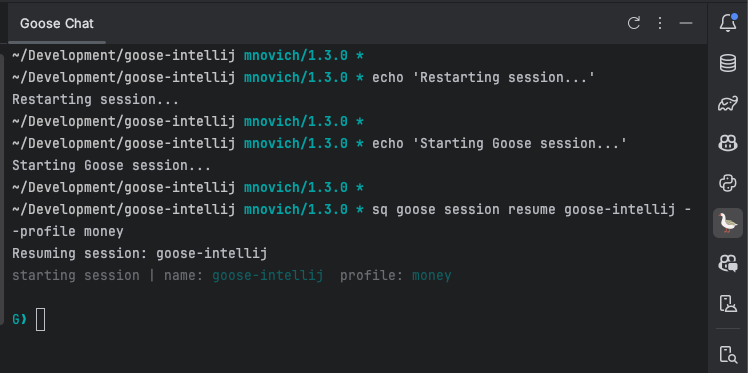
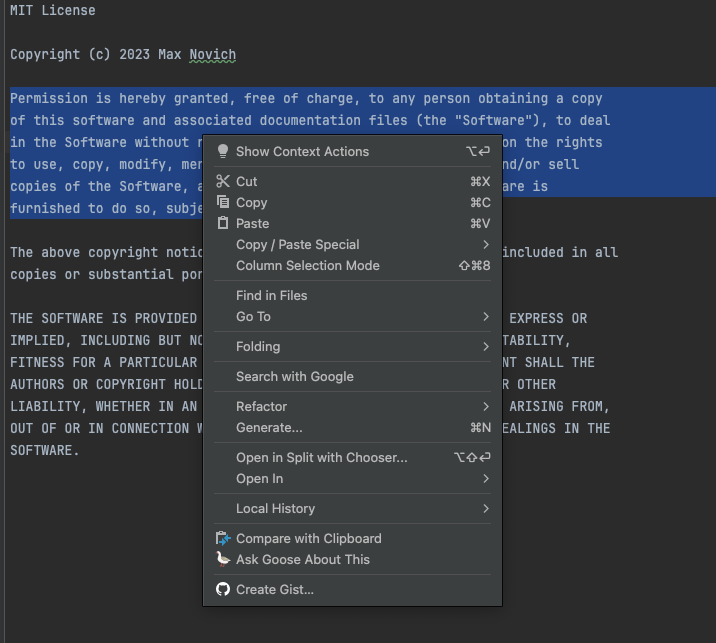
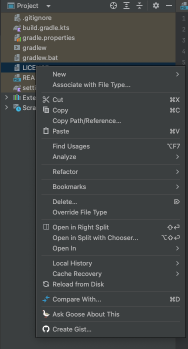

# Goose IntelliJ Plugin

## Overview
Goose IntelliJ Plugin is designed to integrate the Goose AI assistant into the IntelliJ platform, providing developers with smart coding assistance and interactive terminal support.

## Features
- **Smart Code Analysis**: Select code and get insights from the Goose AI.
- **Interactive Terminal**: Integrated terminal with Goose AI session support.
- **File and Directory Information**: Ask Goose about specific files or directories within your project.

## Installation
1. Download the plugin from the IntelliJ Plugin Marketplace.
2. Install the plugin through IntelliJ IDEA by navigating to `Settings -> Plugins -> Install Plugin from Disk`.
3. Restart IntelliJ IDEA to activate the plugin.

## Usage
### Opening the Goose Terminal
To open the Goose Terminal, click on the Goose icon in the tool window bar.

  

### Sending Code to Goose
1. Select the code you want to analyze.
2. Right-click and select `Ask Goose About This`.
3. View the analysis results in the Goose Terminal.

  

### Asking Goose About a File or Directory
1. Right-click on a file or directory in the Project view.
2. Select `Ask Goose About This`.
3. Goose will provide information about the selected item in the terminal.

  

## Development
### Prerequisites
- IntelliJ IDEA 2020.1 or later
- Java SDK 8 or later

### Build and Run from Source
1. Clone the repository.
2. Open the project in IntelliJ IDEA.
3. Click `Run` to build and start the plugin.

## Contributing
We welcome contributions! Please open an issue or submit a pull request for any changes. 
For major changes, please open an issue first to discuss what you would like to change.

## License
This project is licensed under the MIT License. See the [LICENSE](LICENSE) file for details.
