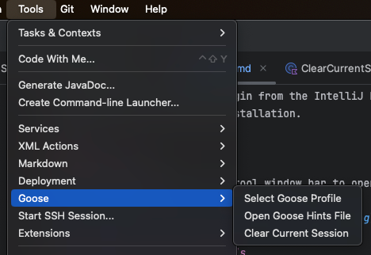

# Goose IntelliJ Plugin

## Overview
The Goose IntelliJ Plugin seamlessly integrates the Goose AI assistant into the IntelliJ platform, enhancing developers' workflow with intelligent coding assistance and terminal capabilities.

## Features
- **Smart Code Analysis**: Easily highlight code to receive sophisticated insights from Goose AI.
- **Interactive Terminal**: The plugin provides a terminal with Goose AI support, enabling interactive sessions directly within IntelliJ.
- **Support for .goosehints**: Now processes .goosehints files for extended configuration capabilities.
- **Session Management**: Improved session persistence, saving and restoring sessions, plus the ability to clear current sessions.
- **Integrated Shell Actions**: Restart shell functionalities available directly in the UI.
- **Profile Management Enhancements**: Easier management and selection of Goose AI profiles.
- **Dark Mode Support**: Fully compatible with IntelliJ's dark theme.
- **Inline Chat with Hotkey**: Quickly bring up a chat window inline using a customizable hotkey (option+G/ alt+G by default), facilitating rapid interaction with Goose AI during coding.

## Installation
1. Download and install the plugin from the IntelliJ Plugin Marketplace.
2Restart IntelliJ IDEA after installation.

## Usage
### Goose Terminal
Click on the Goose icon in the tool window bar to open the Goose Terminal.

  

### Using Goose for Code Analysis
1. Highlight the desired code segment.
2. Right-click and select `Ask Goose To ...`, or use the ALT+G hotkey.
3. Provide your inquiry in the inline chat window.
4. Review the results produced by Goose AI in the integrated terminal.

  

### Inquiring About Files or Directories
1. Right-click any file or directory within Project view.
2. Choose `Ask Goose To ...`.
3. Provide your inquiry in a dialog box.
4. Information will be provided in the terminal window.

  
  

### Managing Goose Profiles
1. Access the `Goose` menu within the Tools menu.
2. Opt for `Profile Management`.

  
3. The profile dialog allows selection or creation of a new profile.

  

### Clear Current Session
Clear your current session easily through the new session management action and restart with new settings as needed.

### Restart Shell Action
Sometimes your goose shell can get stuck or you may want to restart it for other reasons. You can now do this directly from the UI.

## Development
### Required Environment
- IntelliJ IDEA version 2020.1 or newer
- Java SDK version 8 or above

### Building From Source
1. Clone the repository to your local machine.
2. Open the project using IntelliJ IDEA.
3. Use the `Run` option to build and launch the plugin.

## Contributing
We appreciate and welcome contributions. Feel free to open issues or submit pull requests. For substantial changes, discuss your proposition in an issue first.

## License
This plugin is distributed under the MIT License. See the [LICENSE](LICENSE) file for further licensing details.
